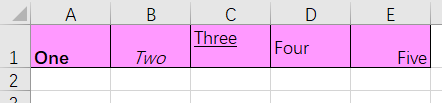
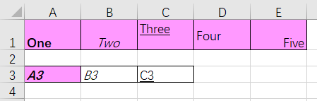

# xlwings——Python for Excel
## [demo00](https://github.com/BellaZZZZZ/xlwings-demo/blob/master/demo/demo00.py)
- `xlwings`新建保存重命名表
- `xlwings`插入删除行列
- `xlwings`复制行列
- `xlwings`批量写入数据
## [demo01](https://github.com/BellaZZZZZ/xlwings-demo/blob/master/demo/demo01.py)
`xlwings`获取有数据的所有行数和列数
```
used_range
Used Range of Sheet.
 
Returns:	
Return type:	xw.Range
```
```
last_cell
Returns the bottom right cell of the specified range. Read-only.
 
Returns:	
Return type:	Range
```
## [demo02](https://github.com/BellaZZZZZ/xlwings-demo/blob/master/demo/demo02.py)
`xlwings`读取整个sheet到`pandas.DataFrame`
## [demo03](https://github.com/BellaZZZZZ/xlwings-demo/blob/master/demo/demo03.py)
`xlwings`保存与另存为
使用xlwings处理excel有时会需要在原表格上进行更改，当然可以选择提取数据再进行相关操作，也可以操作之后另存为。
## [demo04](https://github.com/BellaZZZZZ/xlwings-demo/blob/master/demo/demo04.py)
`xlwings`设置字体加粗、倾斜、居中、下划线以及颜色等
参考：[【python】xlwings如何设置字体、颜色等属性](https://blog.csdn.net/weixin_37577134/article/details/89048798)
demo04效果(before)：
<div align=center>
  
</div>
运用该博主的方法，我们先在excel把自己想要的格式设置出来：
- ‘One’：加粗，左对齐靠下
- ‘Two’：倾斜，居中靠下
- ‘Three’：下划线，左对齐靠上
- ‘Four’：左对齐居中
- ‘Five’：右对齐靠下
- 全框线，粉色
demo04效果(after)：
<div align=center>
  
</div>


